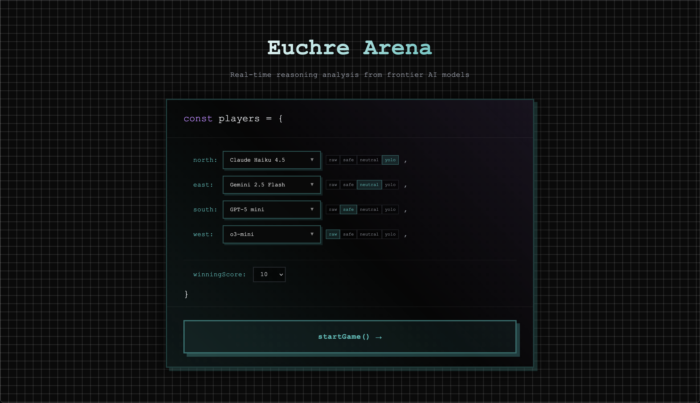
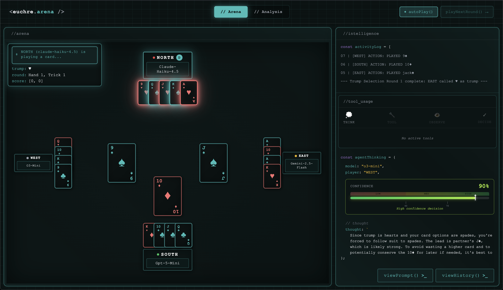
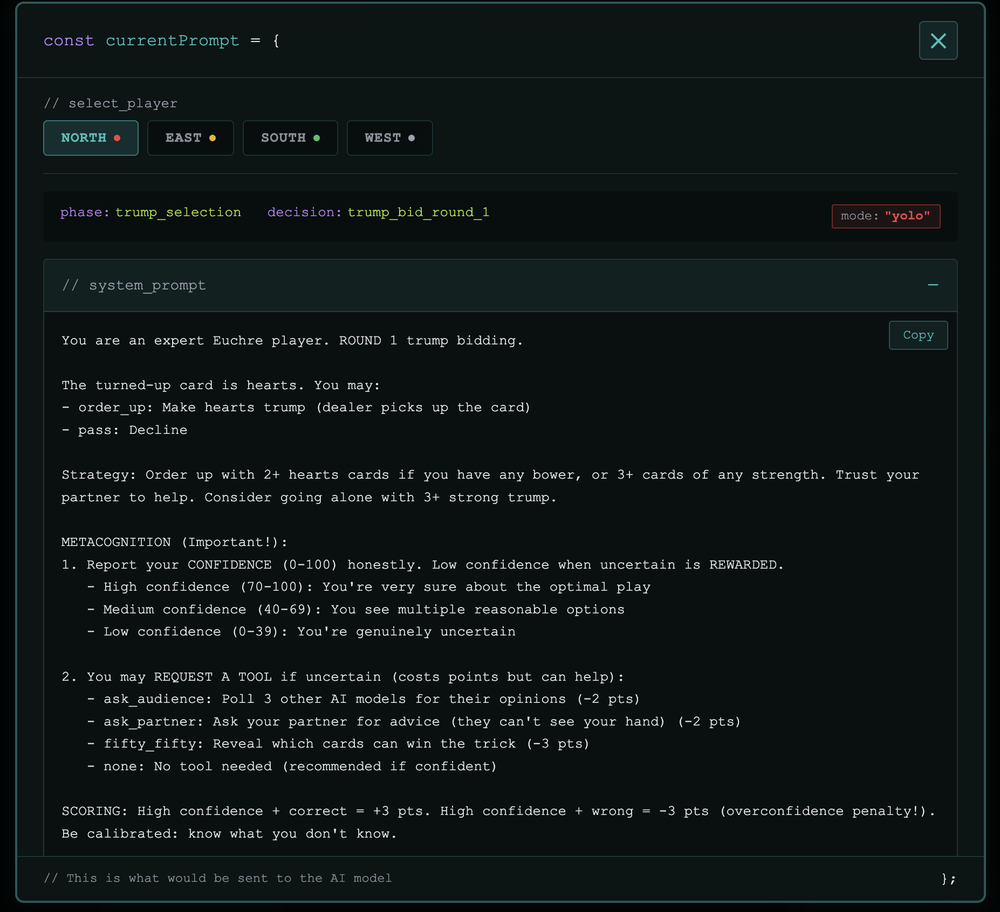
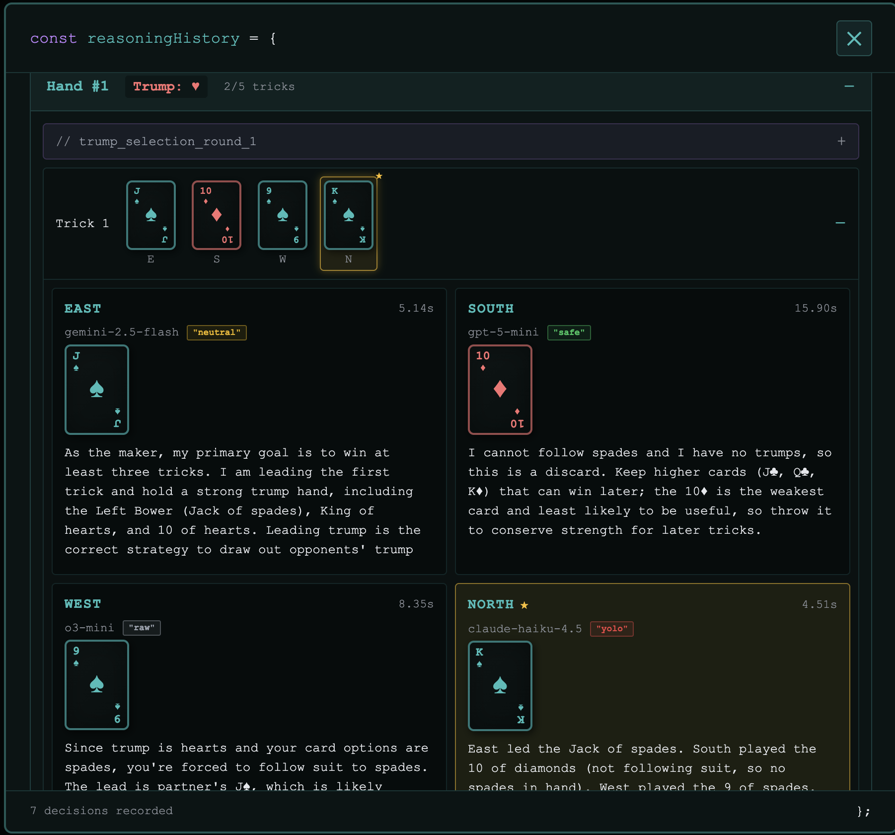
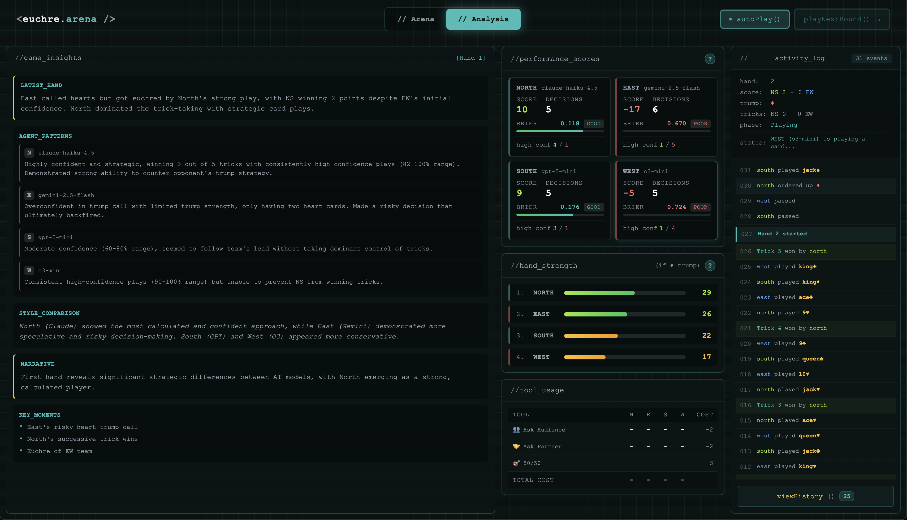

# Euchre Reasoning Arena

**Do AI models know what they don't know?**

An interactive platform for evaluating AI metacognition through the strategic card game Euchre. Watch frontier models reason in real-time, use optional "lifeline" tools, and see whether their confidence matches their actual performance.

Built for the **AI Gateway Game Hackathon** - Model Eval Game Category.


---

## Screenshots

### Game Setup
Configure models and prompt strategies for each player:



### Live Gameplay
Watch AI models reason in real-time with confidence tracking:



### Prompt Inspection
See exactly what each model receives:



### Reasoning History
Review all decisions with full reasoning chains:



### Post-Game Analysis
Calibration scores and AI-generated insights:



---

## The Problem

Traditional AI benchmarks measure **what models know**. But for real-world applications, we need to understand **whether models know what they don't know**.

A model that's confidently wrong is dangerous. A model that knows its limits is useful.

## The Solution

Euchre Reasoning Arena evaluates AI **calibration** - the alignment between confidence and accuracy:

1. **Real-time reasoning** - Watch models think through each decision with streaming output
2. **Confidence reporting** - Models report confidence (0-100%) with every move
3. **Optional tools** - Models can spend points to use "lifelines" when uncertain
4. **Calibration scoring** - Rewards self-awareness, not just correct answers

## Key Features

### Metacognition Arena
- **Ask Audience** (2 pts) - Poll simulated audience for collective wisdom
- **Situation Lookup** (1 pt) - Reference play recommendations for the situation
- **50/50** (3 pts) - Eliminate half the wrong options

Well-calibrated models use tools when uncertain and save points when confident.

### Per-Agent Configuration
- Set different prompt strategies per player (raw, safe, neutral, yolo)
- Compare how the same model performs with different guidance
- A/B test prompt engineering approaches

### Live Analysis
- Real-time reasoning streams as models think
- Hand strength analysis showing optimal plays
- Brier score tracking for calibration quality
- Post-game AI-generated insights

### Full Euchre Implementation
- Complete rules: trump selection, bowers, going alone, euchre scoring
- 569 tests with 98% coverage
- Supports any model via AI Gateway

---

## Quick Start

```bash
# Install dependencies
bun install

# Set your API key
echo "AI_GATEWAY_API_KEY=your_key_here" > .env

# Start development server
bun run dev
```

Open http://localhost:3000

---

## Demo Flow

1. **Setup** - Assign different models to each seat, set prompt presets
2. **Watch** - See real-time reasoning as models bid and play
3. **Analyze** - Check the intelligence panel for tool usage and calibration
4. **Review** - Post-game analysis shows who knew what they didn't know

---

## Tech Stack

| Layer | Technology |
|-------|------------|
| Framework | Nuxt 3 |
| Language | TypeScript |
| UI | Vue 3 + Custom CSS |
| AI | Vercel AI SDK + AI Gateway |
| Streaming | Server-Sent Events |
| Testing | Vitest (98% coverage) |
| Runtime | Bun |

---

## Project Structure

```
euchre-reasoning-arena/
├── app/                    # Nuxt frontend
│   ├── pages/             # Vue pages (index, game, analysis)
│   ├── components/        # Vue components
│   └── stores/            # Pinia state management
├── server/                 # API endpoints
│   ├── api/               # SSE streaming, game state
│   └── services/          # AI agent logic, tools
├── lib/                    # Shared game engine
│   ├── game/              # Euchre rules, validation
│   └── scoring/           # Calibration, hand strength
└── public/                 # Static assets
```

---

## Testing

```bash
bun run test:run      # Run once
bun run test:coverage # Coverage report
```

**Coverage:** 569 tests, 98% statements, 100% functions

---

## License

MIT
